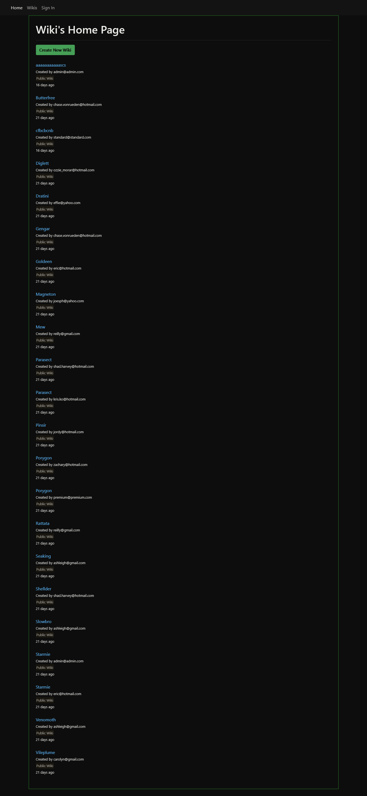

# Blocipedia

A Ruby on Rails CRUD application, encompassing some staple Ruby Gems, that allows users to create public and private Markdown-based wikis.

[Visit Site](https://vast-atoll-63143.herokuapp.com/)

[Case Study](https://samibirnbaum.com/portfolio/blocipedia.html)

## Usage

1. Fork and clone the repo: `git clone https://github.com/samibirnbaum/blocipedia.git`
2. You must have Ruby installed (built using version 2.4.1)
3. Run `$ bundle install` to download/install the needed dependencies
4. Start the local server: `$ rails s`.
5. Open a web browser and go to `http://localhost:3000`.

